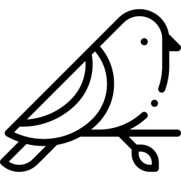

# hashing

Checking intractability.

## word

* hash of `helloworld` is NOT same to hash of `Helloworld`
* but `Helloworld`'s hash is same to `Helloworld`'s

## image

two are different when hashed.

| bird.png | bird_other.png |
| -- | -- |
|  |  |
